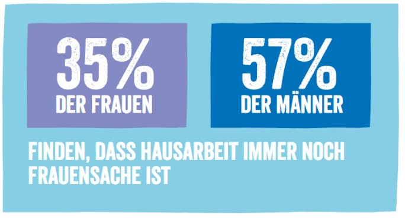
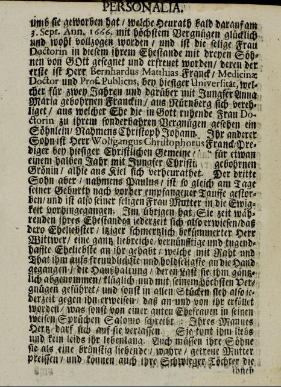
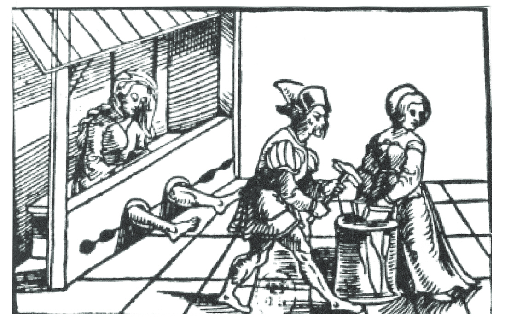

<!--

author: Swantje Piotrowski, Gregor Große-Bölting
email:  ggb@informatik.uni-kiel.de
version: 0.1
language: en
narrator: UK English Female

-->

# Projektseminar zur Geschichte der Neuzeit: Frauengeschichte(n) in der Frühen Neuzeit digital erschließen.

**Dozierende:**

* Dr. Swantje Piotrowski, M.A.
* Dr. Gregor Große-Bölting, M.A., M.A.

**Zeit und Raum:** Do 10:15 - 11:45, Raum LS 11-R. 109

**Inhalt:**

Über das Leben und Wirken von Frauen im öffentlichen Raum im 17. und 18. Jahrhundert ist wenig bekannt. Im Gegensatz zu den Männern hinterließen sie nur selten Spuren in historischen Überlieferungen. Im Universitäts- und Landesarchiv in Schleswig befinden sich jedoch Quellen, die bislang in Hinblick auf Frauen- und Geschlechterforschung noch nicht ausgewertet wurden. In dieser forschungsorientierten Lehrveranstaltung sammeln, strukturieren und interpretieren Studierende Informationen aus historischen Quellen (z.B. Frauenbiographien), um Einblicke in soziale und familiäre Netzwerke, in karikative Tätigkeiten und den Bildungsstand von Frauen in der Frühen Neuzeit zu erhalten. Die Lehrveranstaltung hat das Format einer (digitalen) Forschungswerkstatt: Der Arbeitsablauf wird Schritt für Schritt entwickelt, umgesetzt und diskutiert. Durch die Forschungspraxis werden Studierende mit digitalen Grundkenntnissen sowie mit gängigen Methoden für die digitale Bearbeitung und Auswertung von handschriftlichen Quellen vertraut gemacht. Die Lehrveranstaltung bildet so eine solide Grundlage für die kritische Anwendung solcher Verfahren im weiteren Studium und in wissensvermittelnden Berufsfeldern. Als Prüfungsleistung gilt die Erstellung eines Reflexionsberichts über den Arbeits- und Forschungsprozess sowie die Visualisierung der Rechercheleistung.

**Lernziele:**

* Transkription von handschriftlichen und gedruckten Dokumenten
* fachwissenschaftliche Einordnung der Quellen
* vertiefte fachwissenschaftliche Kenntnisse (Frauen- und Geschlechtergeschichte, Biographiegeschichte, Public History, Sammlungsgeschichte)
* Methodenkompetenz im Bereich der Digital Humanities
* Visualisierung und Präsentation der Forschungsergebnisse
* Erfahrungen in den Berufs- und Praxisfeldern Wissensvermittlung
* eigenständiges und selbstorganisiertes Arbeiten

**Weiterführende Links und Literatur:**

* Artikel zur Geschlchtergeschichte: https://docupedia.de/zg/Geschlechtergeschichte
* Link zum **DDF:** https://www.digitales-deutsches-frauenarchiv.de
* Link zum **akhfg:** https://akhfg.de
* Link zum **Center for the History of Women Philosophers and Scientists**: https://historyofwomenphilosophers.org/

## Allgemeines und erste Sitzung

### Semesterplan

**Termine:**

| Datum | Thema/Inhalt |
|-------|--------------|
| 18.04. | Begrüßung, Organisatorisches, Erwartungen, Fragen |
| 25.04. | Inhaltliche Einführung in den Themenbereich "Frauen- und Geschlechtergeschichte" |
| 02.05. | Frühe Neuzeit als Epoche / Anfänge und Entwicklungen der Geschlechtergeschichte / Potentiale und Kritik / Diskussion von potenziellen Forschungsthemen |
| 09.05. | Feiertag CHRISTI HIMMELFAHRT |
| 16.05. | Einführung in verschiedene Quellenarten zur Erforschung von Frauenbiographien / Arbeit mit ungedruckten Quellen und Handschriften / Transkribus /  Archivinformationssystem Arcinsys |
| 23.05. | Digitalisierung von Quellen, Arbeit mit Digitalisaten und Forschungsdaten (m. B. Petersen) |
| 30.05. | Besuch im Landesarchiv (mit dem Leiter des Universitätarchivs Dr. Jörg Rathjen) |
| 06.06. | gemeinsame Arbeitssitzung / Analyse der gesammelten Quellen/ |
| 13.06. | Entwicklung von Forschungsfragen / Beispiele für Online-Präsentationen / Präsentation der Quellen |
| 20.06. | Metadatenstandards: Welche gibt es und ihr Sinn und Zweck / Anwendung auf Forschungsergebnisse |
| 27.06. | Omeka S und "How to" zur Präsentation der Quellen |
| 04.07. | gemeinsame Arbeitssitzung / Recherche / Feedback und Beratung zur Weiterentwicklung der Forschungsprojekte |
| 11.07. | Präsentation der (Zwischen-)Ergebnisse, Evaluation |

#### ScanTent

#### Transkribus

#### Omeka

### Prüfungsleistung

Produkt zur Darstellung der ausgewählten Quellen inkl. Reflexion zur frauengeschichtlichen Bedeutung.

Details folgen im Laufe des Semesters.

### "Regierungserklärung"

1. Diese Veranstaltung ist eine Forschungswerkstatt: Wir setzen neue Methoden und Software ein. Seien Sie also nachsichtig mit uns und mit sich selbst, wenn mal etwas nicht funktioniert wie geplant. Lassen Sie uns zeitnah wissen, wenn Sie Probleme haben, dann findet sich für alles eine Lösung!
2. Weil es sich um eine Forschungswerkstatt handelt, erwarten wir Eigenengagement und Eigeninitiative für das Thema: Sie werden an verschiedenen Stellen selbst recherchieren, arbeiten und experementieren müssen. Im Gegenzug unterstützen wir Sie, wo wir können.
3. Es kann sein, dass Sie in Ihren Quellen wenig oder gar keine biographischen Details finden: Das ist auch ein Ergebnis, dessen Dokumentation einen Wert hat!
4. Der Seminarplan ist "im Fluss".

### Aufgabe zur nächsten Woche

Bitte lesen Sie zur nächsten Woche den folgenden Artikel:

* Leonie Schöler: Beklaute Frauen: Denkerinnen, Forscherinnen, Pionierinnen: Die unsichtbaren Heldinnen der Geschichte. München 2024, Einleitung, S. 11-23 (im Olat-Ordner).

Desweiteren können Sie optional und zur weiteren Vertiefung den folgenden Artikel lesen:

* [Kirsten Heinsohn](https://docupedia.de/zg/Docupedia:Kirsten_Heinsohn "Docupedia:Kirsten Heinsohn"), [Claudia Kemper](https://docupedia.de/zg/Docupedia:Claudia_Kemper "Docupedia:Claudia Kemper"), Geschlechtergeschichte, in: Docupedia-Zeitgeschichte, 04.12.2012, [http://docupedia.de/zg/heinsohn_kemper_geschlechtergeschichte_v1_de_2012](https://docupedia.de/zg/Docupedia:Kirsten_Heinsohn)

## Sitzung am 25.04.2024

### Gruppenarbeit Mind-Map

1. Bilden Sie Gruppen von 3 bis 4 Teilnehmenden.
2. Jede Gruppe wählt ein Hauptthema aus dem Bereich der Frauen- und Geschlechterforschung, z.B. Frauen in der Wissenschaft, Frauen und Religion, Frauen und Bildung, etc.
3. Erstellen Sie eine Mind-Map. Diese sollte die folgende Elemente enthalten:

   * Hauptthema (z.B. Frauen in der Wissenschaft)
   * Unterkategorien oder Aspekte des Themas (z.B. berühmte Wissenschaftlerinnen, Zugang von Frauen zur Bildung, Herausforderungen für Frauen in der akademischen Welt, etc.)
   * Schlüsselbegriffe, Personen, Ereignisse oder Quellen, die mit den Unterkategorien verbunden sind

4. Jede Gruppe präsentiert ihre Mind-Map und erläutert kurz die ausgewählten Themen.

#### Ergebnisse: Gruppe "Bildung"

#### Ergebnisse: Gruppe "Macht"

#### Ergebnisse: Gruppe "Religion"

#### Ergebnisse: Gruppe "Wissenschaft"

#### Ergebnisse: Gruppe "Politik"

### Aktuelle Debatten um Stereotypen

> Sind diese Geschlechterstereotype aktuell überwunden? Was meinen Sie?

{{1}}
> _Die bereits erwähnten Stereotypen und bestehenden Vorurteile gegenüber Frauen sind weiterhin präsent, wie eine aktuelle Untersuchung zur "Darstellung von Geschlechterrollen in sozialen Medien und deren Einfluss auf die Geschlechtergerechtigkeit" verdeutlicht:_

{{2}}

{{3}}
********

Quelle: [https://www.plan.de/rollenbilder-in-social-media.html?sc=IDQ24200](https://www.plan.de/rollenbilder-in-social-media.html?sc=IDQ24200)
********

### Aufgabe zur nächsten Woche

Bitte lesen Sie zur nächsten Woche den folgende Artikel:

* Geschlechterrollen in der Frühen Neuzeit: https://referenceworks.brill.com/display/entries/EDNO/COM-272465.xml

* Epochenbegriff Frühe Neuzeit: https://referenceworks.brill.com/display/entries/EDNO/COM-267907.xml#d39764389e786

* Natalie Zemon Davis, Neue Perspektiven für die Geschlechterforschung in der Frühen Neuzeit; im Olat-Ordner

## Sitzung am 02.05.2024

### Leichenpredigt Katharina Franck (1698)

Die vollständige Leichenpredigt finden Sie im OLAT.

**Titel:** Das Testament und letzter Wille des sterbenden Jesu

**Untertitel:** Bey Christlicher Leichbestattung Der Weiland Hoch Edlen Groß Ehr- und Hochtugendreichen Frauen Frauen
Catharina gebohrnen Clausen Des Magnifici, HochEhrwürdigen/ HochEdlen und Hochgelahrten Herrn Christophori Francken
SS. Theol. Doctoris, fürnehmsten Professoris und hochansehnlichen Procancellarii dieser hochlöblichen Universität
hertzgeliebten Hauß-Ehre In damahliger Leichen-Predigt aus Joh. XVII, v. 24. (Vater Ich will/ daß wo Ich bin etc.) Am Sontage
Oculi, war der 27. Martii dieses itztlauffenden 1698sten Jahrs in der Haupt-Kirchen St. Nicolai im Kiel in Volckreicher
Versamlung eröffnet.

#### Personalia

Finden Sie an der Leichenpredigt etwas überraschend? Wenn ja was?

{{1}}
> * ganz allgemein: die Tatsache, dass für eine Frau der Frühen Neuzeit eine Leichenpredigt verfasst wurde
> * der Sprachgebrauch (herzliche, teilweise liebevolle Begriffe und Äußerungen)
> * Beispiel: "welche mit Raht und That ihm aufs freundschaftlischste und holdseligste an die Hand gegangen."
> * ein Sprachgebrauch, der sich quasi auf "Augenhöhe" mit den Leichenpredigten, die für Männer geschrieben wurden, befindet
> * ausführlich wird auf die soziale Herkunft und den Stand von Katharina Franck verwiesen
> * ihre Zugehörigkeit zum gehobenen Bürgertum Kiels scheint den Stellenwert ihres Geschlechts abzulösen 

#### Frauengeschichtliche Interpretation

Welche Textstellen aus dem Abschnitt zu den "Personalia" würden Sie als Beschreibung typisch weiblicher Merkmale kennzeichnen?

{{1}}
********
**Quellenauszüge:**

> * ganz liebreiche, vernünftige und tugendhafte Eheliebste (Rolle der Ehefrau)
> * die Haushaltung, deren Last sie ihm gänzlich abgenommen (Rolle der Hausfrau)
> * daß an und für ihr erfüllet worden, was sonst von einer guten Ehefrauen in seinen weisen Sprüchen Salomo schreibt: Ihres Mannes Herz darf sich auf sie verlassen (die treue Hausfrau)
> * auch müssen ihre Söhne sie als eine brünstig liebende, wahre, getreue Mutter preissen (die Rolle der Mutter)

> _Die Zuschreibung als Mutter, Hausfrau und Ehefrau verweist die Frau auf die private Sphäre des Hauses (Privatheit), während die öffentliche Sphäre, Politik und Berufswelt, den Männern zugeordnet wurde (Öffentlichkeit)_
********

### Inkshedding: Themenfindung

1. Falten Sie ein DIN A4-Blatt vertikal in der Mitte. Vervollständigen Sie auf der linken Seite des Knicks den nachfolgenden Satz. Nutzen Sie die komplette linke Seite und schreiben Sie möglichst leserlich! Sie haben 10 Minuten Zeit.

> Der Aspekt … interessiert mich besonders an der Frauengeschichte der Frühen Neuzeit, weil …

2. Anschließend werden alle Zettel eingesammelt, gemischt und erneut ausgeteilt. Lesen Sie den (hoffentlich fremden) Text, markieren und kommentieren Sie die Punkte, die Ihnen besonders gut gefallen und spannend sind. Achten Sie auf interessante Inhalte und kommentieren Sie bitte immer positiv, etwa so: „Großartige Idee! Dazu fällt mir auch ein, dass …“. Dazu stehen 5 Minuten zur Verfügung.
3. Wir wiederholen 2. ein zweites Mal.

### Aufgabe zur nächsten Woche

1. Melden Sie sich beim [Archivinformationssystem Schleswig-Holstein](https://arcinsys.schleswig-holstein.de) an und machen Sie sich mit der Suche und der Struktur der Gliederung der Akten vertraut.
2. Versuchen Sie sich an der Transkription der folgenden Handschriftseite aus einem Zauberey-Prozess:

## Sitzung am 09.05.

Entfällt wg. Feiertag!

## Sitzung am 15.05.

### Transkription der Handschrift zur Hexenverfolgung

Landesarchiv Schleswig-Holstein Abt. 7/Nr. 1758 und Amtsrechnung 106/ Bordesholm (1638-39)

#### Transkription
WolEdle Gestrenge Ehr[?]este GroßAchtbare 
und hochgelarte großgünstige hochgeehrte liebe herrn 
D. herlick: und hochgel. gst. kan ich hiemit und 
dienstlich nicht bergen, Waßgestaldt mir dieses 
Ambts underthan Carsten Resen zue Wackenbegke 
wehemütiglich geklaget, daß seine Haußfraue 
nun eine geraume zeithero betlegerig gewesen, 
und in ihren gliedern große schmertzen empfunden, 
Welcheß wie er und seine Haußfraue vormeinen
ihr von einem alten Weibe in selbigem dorffe 
Anneke Drewes geheißen angethan und veruhr-
sachet wurde, dan wie gemelte seine fraue für 
ungefehr 2 Jahren mit gemelter Dreweschen in 
streith und wordtgezangk gerathen, und seine fraue
dero Zeit schwanger gewesen, wehre die Drewesche 
mit diesen Worten gegen ihr herauß gefahren: 
Hörstu de Gehall mit deme du im geist, 
wehe und bange werden, darauff sie dan als [forth] unge- 
sundt geworden, seid dehme keinen guten tagk
gehabet und wehre daß Kindt wie eß zur
weldt kommen, fast an allen gliedern vorlähmet
gewesen ist hette sich auch unterm bette dar-
auff daß Kindt mit der Mutter gelegen des Nachts
sich ein gespenst erreüget, welcheß die bette steite 

Carsten Rese. c/a Anneke Drewes 
8/12 1638

#### Kontext des Quellenabschnitts

1638 wurde Anneke Drewes von ihrem Nachbarn und dessen Frau nach einem Streit angeklagt wegen
Hexerei, Kindsmord (Bezauberung einer Schwangeren und Tod des Kindes nach eineinhalb Jahren!) und
Viehseuche. Herzog Friedrich III erlaubte auf Anfrage Folterung. Aber Anneke Drewes gestand nicht. Man
ließ sie aber nicht frei, sondern sperrte sie 56 Tage im Gefängnis ein. Währenddessen verlangten „sämtliche
Eingesessenen des Dorfes“ Wattenbek einen erneuten Einsatz von Folter. Der Bordesholmer Amtsschreiber
Pund verfasste den Antrag an den Herzog und dieser gab nach, erlaubte aber nur die territio verbalis, die
Schreckung, wobei man der Angeklagten, also Anneke Drewes, die Folterinstrumente zeigte, um ein
Geständnis zu erzwingen. Das Opfer musste dabei annehmen, dass es wieder schreckliche Qualen
auszuhalten hatte. Aber Anneke gestand wieder nicht und wurde freigelassen. Ob die Freilassung in diesem
Fall durch den Fürst direkt oder eine fürstliche Anweisung an das Holstengericht geschah, ist den Akten
nicht genau zu entnehmen.

#### Quellenbeispiel mit Transkribus 

### Automatische Transkription mit Transkribus

Transkribus ist ein Transkriptions-Tool, das von der Read COOP entwickelt wurde und Forschern und Wissenschaftlern dabei hilft, handschriftliche Dokumente zu digitalisieren und zu analysieren. Das Tool basiert auf der optischen Zeichenerkennung (OCR) und maschinellem Lernen und kann sowohl gedruckte als auch handgeschriebene Texte automatisch transkribieren. Darüber hinaus ermöglicht Transkribus auch die manuelle Transkription durch menschliche Transkribenten, wobei das Tool sie bei der Organisation und Verwaltung der Transkription unterstützt.

Das Tool ist besonders nützlich für historische Dokumente, Archive, Bibliotheken und Museen, die ihre Dokumente digitalisieren und archivieren möchten. Transkribus bietet auch verschiedene Analysewerkzeuge an, die es Forschern erleichtern, die Inhalte und Strukturen der transkribierten Texte zu untersuchen.

#### Die Benutzeroberfläche

Die nachfolgenden Screenshots sind nicht mehr ganz aktuell, zeigen aber strukturell immer noch gut, was wo zu finden ist.

##### Workdesk

##### Collections - View

##### Collections - Organizer

##### Document - View

##### Editor - Elements

##### Editor - Layout and Text 1

##### Editor - Layout and Text 2

##### Tools Organizer

#### Der Workflow

1. Account anlegen
2. Collection mit einem sinnvollen Namen erstellen
3. PDF Dokument hochladen: Entweder in der Collection oder unter Upload die Datei auswählen; aufpassen, dass der korrekte Dateityp gewählt wird.
4. Automatische Texterkennung starten:

   * Modelauswahl: *The Text Titan I* (erfordert Premium-Account) oder *The German Giant I* für Handschriften, *Transkribus Print M1* für Print verwenden.
   * Warten: Die Transkription kann einige Zeit in Anspruch nehmen. Einen Überblick über den Fortschritt kann man sich unter "Jobs" verschaffen.

5. Für jede Seite...

   * Layout überprüfen und anpassen: Stimmen die Regionen oder sollten Regionen zusammengelegt werden? Wurden alle Zeilen erfasst? Wurden die Marginalien erfasst?
   * Transkription überprüfen: Erkennungsfehler beheben.
   * Speichern.

6. Export der Ergebnisse

